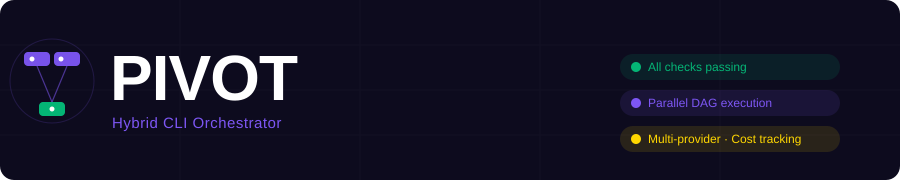

<p align="center">
  
</p>

<p align="center">
  <strong>A universal hybrid CLI orchestrator that combines AI agents and traditional CLI tools in a single workflow</strong>
</p>

<p align="center">
  <a href="https://github.com/Marwanmorsy999/pivot/actions/workflows/ci.yml"></a>
  <a href="https://goreportcard.com/report/github.com/Marwanmorsy999/pivot"></a>
  <a href="https://opensource.org/licenses/MIT"></a>
  <a href="https://golang.org"></a>
  <a href="https://github.com/Marwanmorsy999/pivot/releases"></a>
  <a href="https://codecov.io/gh/Marwanmorsy999/pivot"></a>
  <a href="https://securityscorecards.dev/viewer/?uri=github.com/Marwanmorsy999/pivot"></a>
</p>

---

## Why PIVOT?

PIVOT bridges the gap between AI agents and traditional command-line tools. Instead of choosing between automation and intelligence, get both — orchestrated through a single dependency graph with real-time visibility.

## Features

| Feature | Description |
|---------|-------------|
| **Hybrid Execution** | Seamlessly mix AI agents (Ollama, Claude Code, Gemini CLI) with traditional CLI tools (grep, jq, curl, etc.) |
| **Real-time TUI** | Beautiful terminal UI with live task tracking, cost monitoring, and event logging |
| **Worktree Isolation** | Run AI agents in isolated git worktrees to prevent unwanted changes |
| **Cost Tracking** | Track token usage and estimated costs across all AI operations |
| **Session Management** | Resume failed or paused sessions with full state persistence |
| **Multi-Provider** | Support for Ollama, OpenAI, Groq, Gemini, and Anthropic |
| **Dependency Graph** | Tasks declare dependencies and execute in topological order |

## Runs Everywhere — Super Easy

PIVOT is built with Go (1.21+) and runs on Windows, macOS, Linux, and inside Docker. No complex setup needed — just clone, build, or download the binary.

```bash
# One-line detect + init (auto-configures everything)
pivot detect
pivot init
```

**Supported platforms:**
- Windows (`pivot.exe` / `go build`)
- macOS / Linux (`go install` or binary)
- Docker (`docker build -t pivot .` / `docker run ...`)

See terminal proof shots: [docs/proofs/](docs/proofs/)

---

## Quick Start

```bash
# Initialize pivot (creates config and state DB)
pivot init

# Run a goal
pivot run "Find all TODO comments in the codebase and create GitHub issues for them"

# Check status of recent sessions
pivot status

# Resume a failed session
pivot resume sess_1234567890
```

## Installation

### From Source

```bash
git clone https://github.com/Marwanmorsy999/pivot.git
cd pivot
go mod tidy
go build -o pivot .
```

### Using Go Install

```bash
go install github.com/Marwanmorsy999/pivot@latest
```

### Using Docker

```bash
docker build -t pivot .
docker run -it --rm -v ~/.pivot:/root/.pivot pivot run "your goal"
```

## Configuration

Edit `~/.pivot/config.yaml`:

```yaml
planner:
  provider: ollama  # ollama, openai, groq, gemini, anthropic
  model: llama3.2:3b
  api_key: ""       # For OpenAI/Groq/Gemini/Anthropic
  endpoint: http://localhost:11434

worktree:
  enabled: false
  base_dir: ""      # Defaults to temp dir

cost:
  enabled: true
```

See [config.example.yaml](config.example.yaml) for a full example.

## Architecture

```
pivot/
├── main.go                 # CLI entry point (cobra)
├── internal/
│   ├── config/             # Configuration management
│   ├── state/              # SQLite-backed session & journal storage
│   ├── planner/            # AI-powered task planning (Ollama, OpenAI-compatible)
│   ├── core/
│   │   ├── task.go         # Task type definition
│   │   ├── graph.go        # Dependency graph with topological sort
│   │   ├── executor.go     # Task execution (tool + agent)
│   │   └── orchestrator.go # Main orchestration loop
│   ├── tui/                # Bubble Tea terminal UI
│   ├── worktree/           # Git worktree isolation
│   └── cost/               # Token/cost estimation
├── assets/                 # Project assets (logo, banner)
├── .github/                # GitHub templates and CI
├── docs/                   # Additional documentation
├── Makefile                # Build automation
├── Dockerfile              # Container build
├── LICENSE                 # MIT License
├── CONTRIBUTING.md         # Contribution guidelines
├── SECURITY.md             # Security policy
└── CHANGELOG.md            # Version history
```

## Task Model

The planner generates a JSON task graph:

```json
{
  "tasks": [
    {
      "id": "a",
      "type": "tool",
      "tool": "grep",
      "args": ["-r", "TODO", "."],
      "depends_on": [],
      "description": "Find all TODO comments"
    },
    {
      "id": "b",
      "type": "agent",
      "tool": "ollama",
      "args": ["--prompt", "Summarize $OUTPUT into actionable items"],
      "depends_on": ["a"],
      "description": "Summarize findings with AI"
    }
  ]
}
```

## Development

```bash
# Run tests
make test

# Run linter
make lint

# Build for all platforms
make build-all
```

See [CONTRIBUTING.md](CONTRIBUTING.md) for detailed contribution guidelines.

## Trust & Security

- All tests pass with race detection (`go test -race ./...`)
- CI runs on every push and PR with multi-version Go testing
- Dependencies are regularly audited
- Security vulnerabilities can be reported via [SECURITY.md](SECURITY.md)
- HTTP clients have timeouts to prevent hanging connections

## License

This project is licensed under the MIT License - see the [LICENSE](LICENSE) file for details.

## Terminal Proof Shots

**Auto-detect all providers and local setup:**

```
$ pivot detect
🔍 Pivot Auto-Detection Report
──────────────────────────────
AI Providers Found:
  ✅ ollama
Local Tools Detected:
  ✅ docker  ✅ node  ✅ python3  ✅ kubectl  ✅ npm  ✅ curl  ✅ git  ✅ python  ✅ go  ✅ docker-compose
──────────────────────────────
🏆 Best Provider: ollama (model: llama3.2:3b)
🔌 Endpoint: http://localhost:11434
```

**Super easy init (auto-configured):**

```
$ pivot init
✅ Detected providers & local setup automatically.
🔍 AI Provider: ollama | Model: llama3.2:3b
🔌 Endpoint: http://localhost:11434
🛠 Local Tools Found: 10 (git=true docker=true node=true python=true)
✅ Initialized ~/.pivot/config.yaml (auto-detected)
```

Proof files: [docs/proofs/detect-output.txt](docs/proofs/detect-output.txt) · [docs/proofs/init-output.txt](docs/proofs/init-output.txt)

---

## Acknowledgments

Built with:
- [Cobra](https://github.com/spf13/cobra) — CLI framework
- [Bubble Tea](https://github.com/charmbracelet/bubbletea) — Terminal UI
- [Lipgloss](https://github.com/charmbracelet/lipgloss) — Styling
- [SQLite](https://github.com/mattn/go-sqlite3) — State persistence

---

<p align="center">
  <sub>Built with ❤️ by <a href="https://github.com/Marwanmorsy999">Marwan Morsy</a></sub>
</p>
